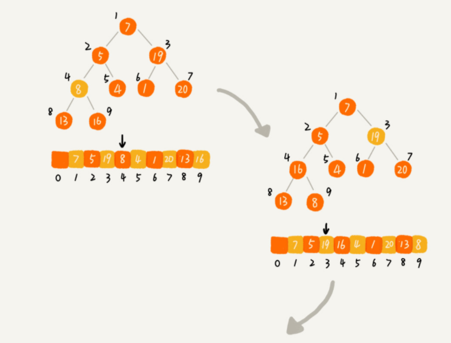
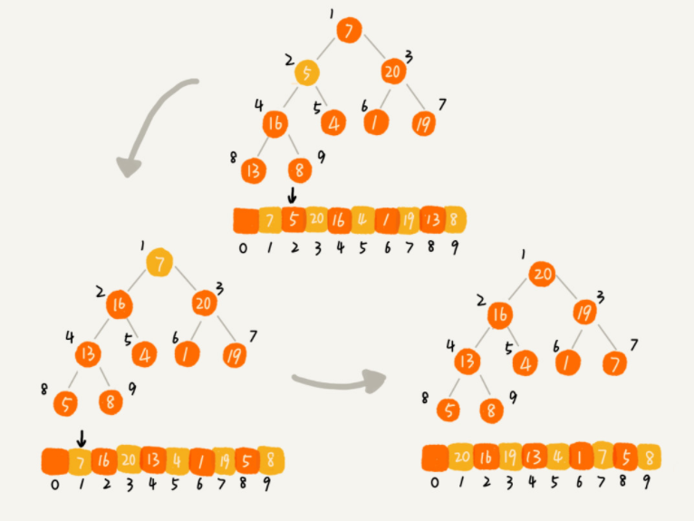

### 一. 学习笔记
   这周的学习明显感觉题目的难度和理解的难度都明显在往
上走，所以也是花了更多的时间在算法上，中心思想还是通过超哥所说
的五毒神掌，不断反复看视频，不断反复看题目，写题目，来让自己
对某一个思想，某一个算法的理解不断加深。

### 二. 自学堆排序
堆排序分为两步：
* 构建堆
* 排序

1. 构建堆

  构建堆的思路是从堆中第一个非叶子节点开始，从上往下进行构建，
  以大顶堆举例，第一个非叶子节点会依次和他的子节点比较，子节点又会不断
  和子节点的子节点进行比较，直到从这个节点出发，都满足大顶堆的要求。然后再循环往复去比较
  第二个非叶子节点，第三个非叶子节点...如图所示：
  
  
  
  
  代码如下所示：
  ```
  /**
       * 构建堆
       */
      public void buildHeap() {
          for (int i = (heap.length >> 1) - 1; i >= 0; i--) {
              upToDownBigHeap(i);
          }
      }

/**
     * 自顶向下堆化（大顶堆）
     * @param index 自顶向下开始堆化的下标
     */
    public void upToDownBigHeap(int index) {
        int child;
        int temp = heap[index];
        while (child(index, 1) < capacity) {
            child = maxChild(index);
            if (temp > heap[child]) {
                break;
            }
            heap[index] = heap[child];
            index = child;
        }

        heap[index] = temp;
    }
  ```
2.排序

  排序的思路很简单，就是将堆顶元素和堆尾元素不断进行交换即可
  ```
/**
     * 堆排序
     */
    public void sort() {
        if (heap.length <= 1) {
            return;
        }

        // 1. 将数组构建成一个堆(从第一个非叶子节点开始构建）
        buildHeap();

        // 2. 排序
        int k = capacity - 1;
        while (k > 0) {
            int temp = heap[k];
            heap[k--] = heap[0];
            heap[0] = temp;
            capacity--;
            heapIndex--;
            upToDownBigHeap(0);
        }
//        System.out.println(Arrays.toString(heap));
    }

/**
     * 自顶向下堆化（大顶堆）
     * @param index 自顶向下开始堆化的下标
     */
    public void upToDownBigHeap(int index) {
        int child;
        int temp = heap[index];
        while (child(index, 1) < capacity) {
            child = maxChild(index);
            if (temp > heap[child]) {
                break;
            }
            heap[index] = heap[child];
            index = child;
        }

        heap[index] = temp;
    }
  ```
  
  